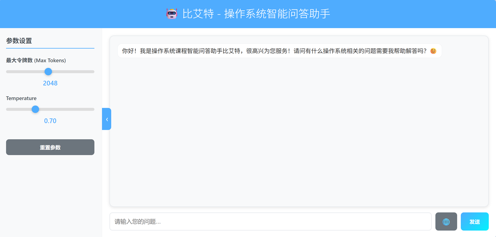

  * # 基于大模型的操作系统智能助手

    本项目是一个为操作系统（Operating System）课程设计的智能问答助手。它基于大型语言模型（LLM），通过在特定领域的知识上进行微调，能够以活泼友好的语气回答与操作系统相关的专业问题。项目提供了一个简洁的Web界面，方便用户进行交互。

    ## 主要功能

    - **专有领域微调**：使用 LoRA 技术对 `Qwen/Qwen2.5-7B-Instruct` 模型进行微调，使其更专注于操作系统领域的知识。
    - **Web交互界面**：基于 Flask 构建了一个友好的Web用户界面，支持实时问答。
    - **双模推理**：支持两种推理模式：
        1.  **本地模式**：调用本地经过微调的模型进行推理，无需API密钥。
        2.  **API模式**：调用外部API（如 SiliconFlow）进行推理。
    - **网络增强搜索**：可选的网络搜索功能，能够从知乎、CSDN等网站抓取实时信息，为模型的回答提供参考。
    - **参数可调**：用户可以在前端界面上动态调整模型的 `Max Tokens` 和 `Temperature` 等参数。

    ## 项目结构

    ```
    .
    ├── data/
    │   └── output.jsonl        # 经过处理的训练数据
    ├── models/                   # 存放下载的基础模型缓存
    ├── src/
    │   ├── finetune_results/     # 存放微调结果和模型
    │   ├── dataset.py            # 数据清洗脚本
    │   ├── plt_loss.py           # 绘制训练损失曲线脚本
    │   ├── train.py              # 模型微调训练脚本
    │   └── trans.py              # 原始数据格式转换脚本
    ├── web/
    │   ├── templates/
    │   │   └── index.html        # 前端页面
    │   └── app.py                # Flask后端应用
    ├── api.py                    # API模式测试脚本
    ├── inference.py              # 本地模型推理测试脚本
    └── README.md                 # 项目说明
    ```

    ## 环境配置

    1.  克隆本项目到本地。
    2.  创建并激活一个Python虚拟环境。
    3.  安装所需的依赖库：
        ```bash
        pip install torch transformers datasets peft bitsandbytes accelerate flask flask-cors requests beautifulsoup4 openai scipy matplotlib
        ```

    ## 使用指南

    ### 1. 数据准备

    - 将原始的问答对数据（例如 `train.json`，包含 `question` 和 `answer` 字段）准备好。
    - 运行 `src/trans.py` 脚本，将其转换为模型训练所需的 `JSONL` 格式。

      ```bash
      # 示例
      python src/trans.py data/train.json data/output.jsonl
      ```
      确保生成的文件路径与 [`src/train.py`](src/train.py) 中的 `DATA_FILE` 配置一致。

    ### 2. 模型微调

    - 检查并修改 [`src/train.py`](src/train.py) 中的 `TrainingConfig` 类，确认模型名称、数据路径和训练参数。
    - 运行训练脚本开始微调：

      ```bash
      python src/train.py
      ```
    - 训练完成后，微调好的LoRA模型将保存在 `src/finetune_results/final_model` 目录下。

    ### 3. 启动Web应用

    - 启动Web服务前，可以根据需求在 [`web/app.py`](web/app.py) 文件顶部修改默认配置，如 `DEFAULT_MODEL_MODE`。
    - 运行 `app.py` 启动后端服务：

      ```bash
      python web/app.py
      ```
    - 打开浏览器，访问 `http://127.0.0.1:5000` 即可开始与智能助手“比艾特”对话。

    ### 4. 独立测试

    - **测试本地模型**：运行 [`inference.py`](inference.py) 脚本，可以在命令行中测试本地微调模型的效果。
    - **测试API模型**：配置好 [`api.py`](api.py) 中的 `API_KEY` 和 `BASE_URL` 后，运行该脚本以测试API的连通性和效果。

    ## 界面截图
    
